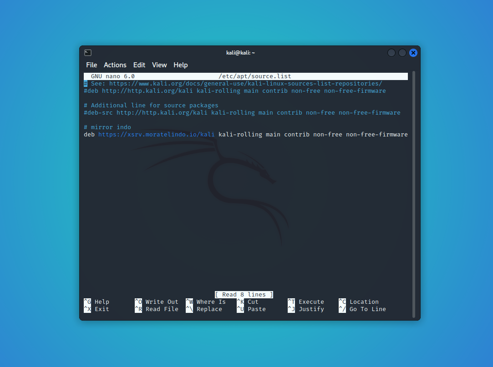

didalam terminal kali-linux
change mirrorlist

```bash
$ sudo nano /etc/apt/source.list
```

in GNU nano

```bash
See: https://www.kali.org/docs/general-use/kali-linux-sources-list-repositories/
#deb http://http.kali.org/kali kali-rolling main contrib non-free non-free-firmware

# Additional line for source packages
#deb-src http://http.kali.org/kali kali-rolling main contrib non-free non-free-firmware
```

tambahkan baris

```bash
# mirror indo
deb https://xsrv.moratelindo.io/kali kali-rolling main contrib non-free non-free-firmware
```



ubah baris pertama dengan `#` menjadi seperti dibawah

```bash
# See: https://www.kali.org/docs/general-use/kali-linux-sources-list-repositories/
#deb http://http.kali.org/kali kali-rolling main contrib non-free non-free-firmware

# Additional line for source packages
#deb-src http://http.kali.org/kali kali-rolling main contrib non-free non-free-firmware

# mirror indo
deb https://xsrv.moratelindo.io/kali kali-rolling main contrib non-free non-free-firmware
```

jika sudah keluar dari vim dengan menekan tombol `ctrl+x` lalu `Y` dan `enter`

update package

```bash
sudo apt update
```
